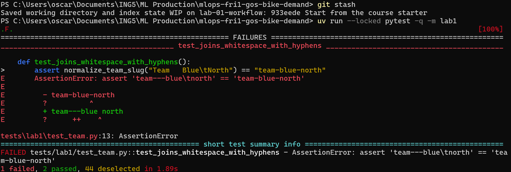
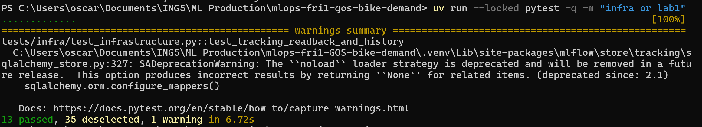
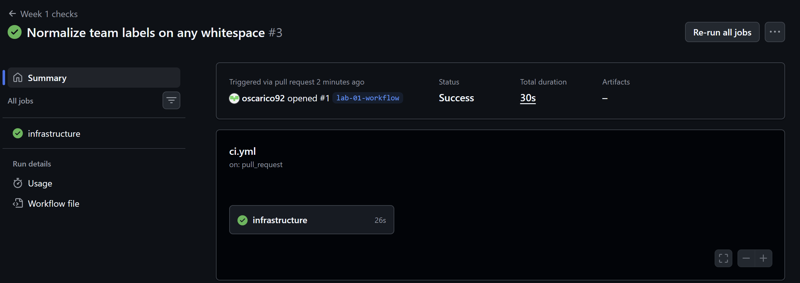
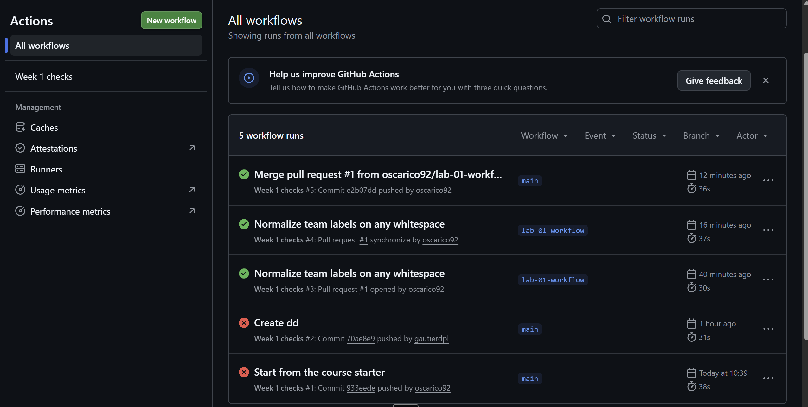

# Lab 1: Team workflow and check record

Record observed facts or blocked/not-run with reasons. This team worksheet is
not an individual's graded Week 1 report.

## Team and setup

- Team/repository: `mlops-fri1-GOS-bike-demand` (https://github.com/oscarico92/mlops-fri1-GOS-bike-demand). TODO: rename to lowercase `mlops-fri1-gos-bike-demand` as required by the naming rule.
- Week/date: Week 1, Lab 1, 2026-10-09
- Members and temporary roles: Oscar Schwartz (`oscarico92`), lead author, pair-programming with Simon Gallais (`Urazikk`); Gautier Deplanque (`gautierdpl`), reviewer; Simon Gallais (`Urazikk`).
- Repository/authentication access checks: private repository created by `oscarico92`; collaborators invited: `gautierdpl`, `Urazikk`, instructor `minhtc-uca` (invitation accepted). Push over HTTPS checked by pushing `933eede` and `lab-01-workflow`.
- OS version/architecture, Python and uv versions: Oscar: Windows 11, x86_64; Python 3.12 (installed by `uv python install 3.12`); uv 0.12.24 (updated from 0.12.5, which `uv sync --locked` rejected: required `>=0.12.19,<0.13`). Gautier: Windows 11 Home 10.0.26200, 64-bit; Python 3.12.15; uv 0.12.23. Simon: macOS, versions to be recorded by Simon.
- Environment/preflight command and actual outcome: `uv run --locked python -m bike_demand.preflight` -> "Preflight passed: imports, frozen snapshot and writable outputs." (Oscar, Windows). Gautier (Windows 11 Home, 64-bit): `uv sync --locked` -> resolved 98 packages, 97 already installed, lock unchanged; preflight -> "Preflight passed: imports, frozen snapshot and writable outputs." Simon: not yet recorded.
- Working agreement and backlog links: [WORKING-AGREEMENT.md](../WORKING-AGREEMENT.md), [BACKLOG.md](../BACKLOG.md)
- Ignored outputs and secret-protection checks: `.venv/`, `artifacts/` and `tracking/` are ignored by `.gitignore`; `git status --short` checked before each commit (only `team.py` and `test_team.py` staged for PR #1); HTTPS credentials handled by Git Credential Manager, no token in commands, commits or screenshots.

## Reviewed change and checks

- Branch, pull request and checked commit: branch `lab-01-workflow`, PR #1 (https://github.com/oscarico92/mlops-fri1-GOS-bike-demand/pull/1), commits `2711c3a` and `6206c52`, merged into `main` as `e2b07dd`.
- Substantive change and responsible contributor: Oscar (`oscarico92`), pair-programmed with Simon (`Urazikk`); commits pushed from Oscar's account. `normalize_team_slug` used `.replace(" ", "-")`, which only replaces single spaces: `"Team   Blue\tNorth"` gave `team---blue\tnorth`. Replaced by `"-".join(team_name.lower().split())`; `split()` without argument splits on any run of whitespace and drops leading/trailing whitespace. The blank-name `ValueError` is unchanged.
- Additional test and why it is useful: `test_mixed_whitespace_and_case_collapse_to_one_slug` covers newlines, an all-caps name, a single word (`"Sparrows"`, added after review) and a blank name made only of `\t\n`. The supplied tests only use spaces and one tab, so this test would catch a fix that handles spaces and tabs but not newlines, or a blank check changed to `.strip(" ")`.
- Reviewer observation, response and merge status: reviewer Gautier Deplanque (`gautierdpl`) checked the fix against the contract and reran the checks on `2711c3a` (ruff check and format passed, lab1 4 passed, infra 9 passed). Observation: add a single-word case so no hyphen is added when there is nothing to join. Response: added in `6206c52`, CI rerun on that commit. Approved by `gautierdpl`; merged by `oscarico92` as `e2b07dd` after approval.
- Local lint/format/test commands and actual results (Oscar, Windows):
  - Before the fix, on `933eede`: `uv run --locked pytest -q -m lab1` -> 1 failed, 2 passed (`test_joins_whitespace_with_hyphens`: `'team---blue\tnorth' == 'team-blue-north'`).
  - After the fix, on `2711c3a`: `uv run --locked ruff check .` -> All checks passed; `uv run --locked ruff format --check .` -> 10 files already formatted; `uv run --locked pytest -q -m "infra or lab1"` -> 13 passed.
  - On `6206c52`: `uv run --locked pytest -q -m "infra or lab1"` -> 13 passed (rerun after the merge on `lab-01-report`, whose code is identical to `6206c52`; CI run #4 also passed on `6206c52` itself).
- Intentional exercise failure versus infrastructure failures: the only failure before the fix was the intentional `lab1` failure; `infra` passed. Two setup problems were diagnosed separately: (1) uv 0.12.5 was below the required version, fixed by updating uv; (2) the `.venv` copied from the starter clone made pytest import the starter's code, fixed by deleting `.venv` and rerunning `uv sync --locked`. One debugging step during the fix: a `return` indented inside the `if` block made the function return `None`; fixed by restoring the indentation. The Lab 2 `exercise` tests fail with `NotImplementedError` as expected and are not part of Lab 1.
- CI check names, actual statuses and checked revision: workflow "Week 1 checks", job `infrastructure` (sync, preflight, ruff check, ruff format, pytest infra, pytest lab1). Run #1, `933eede` on `main`: failed at `pytest -q -m lab1` (expected). Run #2, `70ae8e9` on `main` (direct push, no PR): failed, lab1 still unfixed. Run #3, PR #1 opened, `2711c3a`: success. Run #4, PR #1 synchronize, `6206c52`: success. Run #5, `main` after merge, `e2b07dd`: success.
- Starter/reference/collaborator/other assistance: course starter code and tests by the instructor. Claude (AI assistant) explained the lab, diagnosed the failing assertion and the setup problems, and suggested the fix, the added test and the commands; Oscar applied, ran and checked them. Review by Gautier Deplanque (`gautierdpl`).

## Lab 2 handover

- Next driver/reviewer: Gautier Deplanque (`gautierdpl`) / Oscar Schwartz (`oscarico92`)
- Readiness and remaining blockers: setup works on Windows (Oscar). Open items: rename the repository to lowercase; commit `70ae8e9` ("Create dd", file `dd`) was pushed directly to `main` without a PR and should be removed through a PR; preflight not yet recorded for Simon.
- One bounded next action and owner: Gautier (`gautierdpl`) implements `check_domains` in `validate.py` on a task branch, starting from the failing `exercise` tests.
- Own-contribution links retained for each student's Week 1 report: Oscar: commits `2711c3a`, `6206c52`, PR #1. Gautier: review on PR #1. Simon: pair-programmed the helper fix and added test with Oscar on PR #1 (commits authored from Oscar's machine, `2711c3a`, `6206c52`).

## Screenshots

Save images in `reports/images/` and embed them below, for example
``. Add one line saying what each
image shows and which commit or pull request it belongs to. Include at least the
failing and the passing `lab1` run, and the pull request checks. Crop to the
relevant part and hide tokens, passwords and personal data.

`pytest -q -m lab1` on `933eede` (before the fix): 1 failed, 2 passed.

`pytest -q -m "infra or lab1"` on Oscar's machine with the fix applied (Windows 11): 13 passed, 35 deselected.

GitHub Actions "Week 1 checks" run #3, triggered by opening PR #1 on `lab-01-workflow` (commit `2711c3a`): job `infrastructure` success. Run #4 on `6206c52` also passed (see next image).

GitHub Actions history, runs #1 to #5: `933eede` and `70ae8e9` on `main` failed (lab1 not yet fixed), `2711c3a` and `6206c52` on PR #1 passed, merge `e2b07dd` on `main` passed (run #5).
