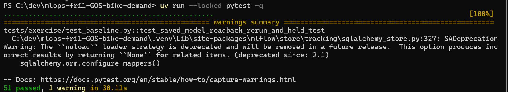
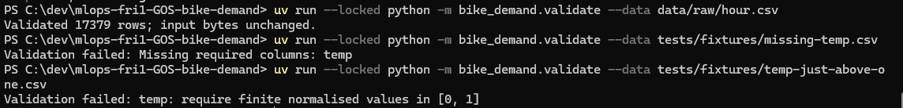
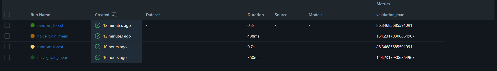

# Week 1, Labs 1–2: team evidence

## Team and roles

Team GOS, repository `oscarico92/mlops-fri1-GOS-bike-demand`: Oscar Schwartz (`oscarico92`),
Gautier Deplanque (`gautierdpl`), Simon Gallais (`Urazikk`).

- Lab 1: Oscar lead author, Gautier reviewer, Oscar evidence recorder. Details in [lab-01.md](lab-01.md).
- Lab 2: Gautier lead author, Oscar reviewer, Simon evidence recorder.

## Repository and pull requests

- Lab 1: PR #1 (`lab-01-workflow`, helper repair + added test), PR #2 (`lab-01-report`, worksheet),
  PR #3 (`lab-01-worksheet-update`, worksheet corrections).
- Lab 2: branch `lab-02-data-baseline`, PR #4.
  - `06093bf` Implement data contract, chronological split and baselines (`validate.py`, `split.py`, `train.py`).
  - `85d3d32` First Fault B (fixture + test); training commit for the recorded runs.
  - Later commits: evidence, screenshots, and Fault B replaced after review (tests/docs only, `src/` unchanged).

## Setup, preflight and quality checks (commands and actual results)

Run by Gautier on Windows 11 Famille 10.0.26200 (64-bit), Python 3.12.15, uv 0.12.23, on `85d3d32`:

| Command | Observed result |
| --- | --- |
| `uv sync --locked` | 97 packages checked, lock unchanged |
| `uv run --locked ruff check .` | All checks passed |
| `uv run --locked ruff format --check .` | 11 files already formatted |
| `uv run --locked pytest -q` | 51 passed, 1 warning (SQLAlchemy deprecation raised inside MLflow) |

CI on the pushed PR revision: _(to record from the PR checks once pushed)_.

## Data identity, validator checks and added test

- Canonical data: `data/raw/hour.csv`, SHA-256 `e03de4ee4ef4dc376ac6e04bf829673c6269e8eba5c60fa121640fa2f829504f`,
  17,379 rows; bytes unchanged after every command (preflight checks the manifest).
- `validate --data data/raw/hour.csv` → `Validated 17379 rows; input bytes unchanged.`
- Rules enforced in `check_domains`: integer categories in their domains (season 1–4, yr/holiday/workingday
  0–1, mnth 1–12, hr 0–23, weekday 0–6, weathersit 1–4); temp/atemp/hum/windspeed finite in [0, 1];
  cnt/casual/registered nonnegative integers; dteday within 2011-01-01..2012-12-31. Each rejection names the
  field; nothing is filled, clipped or dropped.
- Added test: `tests/exercise/test_fault_b.py` (see Fault B below). It fails on the unmodified starter
  `validate.py` (3 failed) and passes with our `check_domains`, so it exercises code written in this PR.

## Partition counts, boundaries and held test rows

Sorted by `(dteday, hr, instant)`, inclusive intervals, nonempty/disjoint/complete checked in `split_data`.

| Partition | Interval | Rows | First (dteday, hr, instant) | Last (dteday, hr, instant) |
| --- | --- | --- | --- | --- |
| train | 2011-01-01 – 2011-12-31 | 8,645 | (2011-01-01, 0, 1) | (2011-12-31, 23, 8645) |
| validation | 2012-01-01 – 2012-06-30 | 4,358 | (2012-01-01, 0, 8646) | (2012-06-30, 23, 13003) |
| test (held) | 2012-07-01 – 2012-12-31 | 4,376 | (2012-07-01, 0, 13004) | (2012-12-31, 23, 17379) |

8,645 + 4,358 + 4,376 = 17,379. Test rows are counted only; no test metric is computed.

## Comparator and RF: run IDs, validation MAEs, metadata/readback

`uv run --locked python -m bike_demand.train --config configs/baseline.yaml` on training commit
`85d3d328c988a49d06a662bee4638be3fe0bf75d`, `working_tree_dirty: false`, 2026-10-09T10:24:50Z.

| Predictor | MLflow run ID | Validation MAE (rentals/hour) |
| --- | --- | --- |
| Training-label mean (143.79) | `978122b6e59648e7b48b444128c728d0` | 154.23 |
| Random Forest (50 trees, depth 10, seed 42) | `fdeed96296154828a8dbc5be2299aa7f` | 86.85 |

- Both fitted on the 8,645 train rows only, evaluated on the same 4,358 validation rows.
- The RF lowers validation MAE by about 67 rentals/hour versus the mean; this is one fixed comparison,
  not a tuned or test-set result.
- Model version `baseline-2d1d6f765429`, model SHA-256 `fd98ceaf…c49c304`.
- Readback: reloaded `artifacts/model.joblib` gives MAE 86.85 (delta 0.0), metadata matches the run,
  logged model bytes match the saved file, max prediction delta 0.0.
- Evidence: `reports/metrics.json`, `reports/metrics-history.jsonl` (committed); tracking DB and model stay local.

## Optional stretch, after the core: unchanged-config repeat (new run IDs, history, differences)

Not attempted as a planned stretch. Note: an earlier run (`naive 3a847cce…`, `rf f27c6667…`) was discarded
because it recorded `working_tree_dirty: true`; it gave the same MAEs and the same model SHA-256.

## Fault diagnosis and your own Fault B

- Fault A (worked): `missing-temp.csv` → `Validation failed: Missing required columns: temp`.
- Choice: Fault B breaks the "weather values finite in [0, 1]" rule with `temp = 1.0000001` in a 6-row copy
  (`tests/fixtures/temp-just-above-one.csv`), all columns kept, one value changed.
- Reason: the value parses as a normal float, so only our `check_domains` range rule can catch it. The bound is
  inclusive and real data sits on it (canonical instant 13164 has `temp = 1.0`), so the test guards both
  directions: a strict `< 1` check would reject real rows, a rounded or loose check would accept the fault.
- Result: `Validation failed: temp: require finite normalised values in [0, 1]`; controls `temp = 1.0` and
  `temp = 0.0` pass; fixture bytes unchanged. Limitation: one field and one bound; the other normalised fields
  rely on the supplied parametrised tests.
- History: the first Fault B (`2011-02-29`) was replaced after review because it was rejected by the supplied
  date parsing in `load_data`, before any code from this PR runs.

## Review observation and author's response

- Reviewer: Oscar (`oscarico92`), PR #4, requested changes. Reran on `753764b` (Windows 11, uv 0.12.24):
  sync, ruff, format, `pytest -q` 51 passed, canonical validation OK; did not rerun `train` to keep the
  committed metrics history unchanged.
- Observation: the Feb 29 Fault B is rejected by the supplied `pd.to_datetime(..., errors="raise")` in
  `load_data`, so its test would pass on the unmodified starter and does not exercise this PR's code.
  Minor: the worksheet cited the wrong PR number.
- Response: Fault B replaced with `temp = 1.0000001` (rejected only by `check_domains`), with inclusive-bound
  controls; checked that the new test fails on the starter `validate.py`. PR numbers corrected (#3 = Lab 1
  worksheet update, #4 = Lab 2).

## Contribution and assistance/recovery acknowledgement

- Gautier: implemented the Lab 2 TODOs and Fault B, ran the checks and training on his machine.
- Oscar: review of PR #4 (independent rerun, Fault B observation).
- Simon: evidence recording.
- Starter code, tests, tracking helpers and fixtures supplied by the course.
- _(Other assistance: to complete by the team.)_

## Blockers and next action

- Blocker found and fixed: the first training run was marked dirty because a shell redirect created an
  untracked output file before the run; outputs removed and training rerun on a clean tree.
- Local clock was about 10 h behind; corrected before the recorded run.
- Next: Oscar re-reviews PR #4; merge after approval and green CI on the latest commit; tag `m1`.

## Screenshots

Full suite on `85d3d32` (Gautier's machine): 51 passed, 1 MLflow-internal warning.

Canonical CSV accepted (17,379 rows); Fault A (`missing-temp.csv`) and Fault B
(`temp-just-above-one.csv`) rejected with the field named.

Experiment `bike-demand-baseline`, `validation_mae` column. The two runs created "12 minutes ago" are the
recorded runs on `85d3d32` (`fdeed962…` random_forest 86.85, `978122b6…` naive_train_mean 154.23). The two
"10 hours ago" runs are the discarded dirty run, timestamped while the local clock was about 10 h behind.
